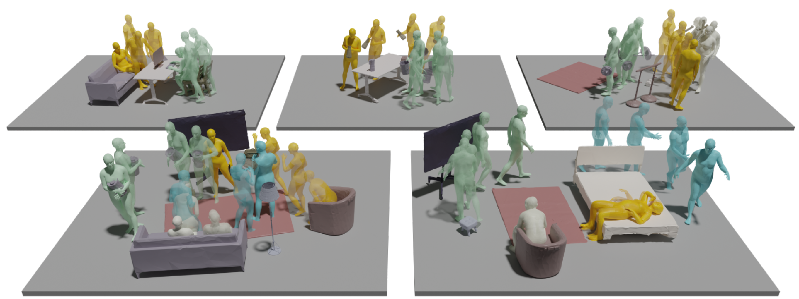
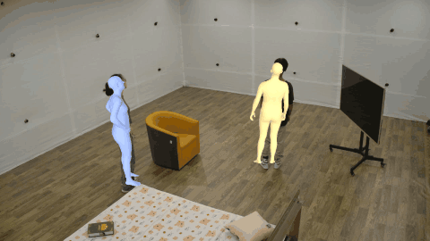
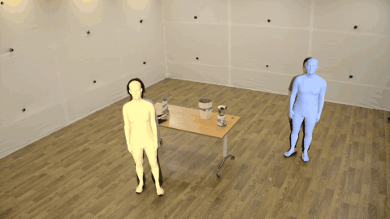
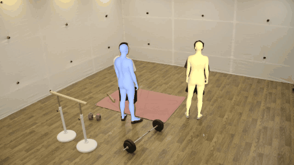

<h1 align="center">HOI-M³ Dataset Toolbox</h1>

<p align="center">
  <b>HOI-M³: Capture Multiple Humans and Objects Interaction within Contextual Environment</b><br>
  <i>CVPR 2024 (Highlight)</i>
</p>

<p align="center">
  <a href="https://arxiv.org/pdf/2404.00299">[Paper]</a> &nbsp;•&nbsp;
  <a href="https://www.youtube.com/watch?v=Fq6iqoXC99A&t=2s">[Video]</a> &nbsp;•&nbsp;
  <a href="https://juzezhang.github.io/HOIM3_ProjectPage/">[Project Page]</a> &nbsp;•&nbsp;
  <a href="https://huggingface.co/datasets/JuzeZhang/HOI-M3">[Videos — HuggingFace]</a> &nbsp;•&nbsp;
  <a href="https://drive.google.com/drive/folders/1pXUHX0Y9Q6IVKNxjzz7iuRoFPCGociOF?usp=sharing">[Annotations — Google Drive]</a>
</p>

<p align="center">
  
</p>

HOI-M³ is a large-scale dataset for modeling the interactions of **multiple humans and multiple
objects** within realistic, contextual environments. This toolbox provides everything to download,
preprocess, and visualize the dataset: multi-view image extraction, instance-mask reading/validation,
MHR→SMPL-X conversion, and rendering of the human/object annotations.

> This is the **HOI-M³** toolbox. For the single-person, dome-captured **HODome / NeuralDome**
> dataset (CVPR 2023) see the separate [NeuralDome Toolbox](https://github.com/Juzezhang/NeuralDome_Toolbox).

---

## Dataset at a glance

| | |
|---|---|
| Sequences | **204** — bedroom 36 · diningroom 23 · fitnessroom 27 · livingroom 57 · office 61 |
| Camera views | **42** synchronized cameras |
| Scene content | multiple humans + multiple objects, in contextual room layouts |
| Annotations | multi-view RGB, instance masks, mono MHR body, VitPose 2D keypoints, multi-view SMPL-X/MHR fits, per-frame object 6-DoF poses, scanned object meshes |
| Calibration | refined ground calibration (`calib_ground_refined`), all 42 views |

## 🚩 Updates
- **Jul 1, 2024** — Due to the large mask size, the annotated masks are initially released for view 3 only; the full masks + this toolbox's regeneration pipeline recover all 42 views.
- **Jun 30, 2024** — Note: object rotations in the initial release were saved as the **transpose** of the rotation matrix — transpose them back before use.
- **Jun 12, 2024** — HOI-M³ dataset upload to Google Drive.

---

## 📖 Setup

```bash
conda create -n hoim3 python=3.10 -y
conda activate hoim3
conda install pytorch==2.4.0 torchvision torchaudio pytorch-cuda=12.1 -c pytorch -c nvidia

# PyTorch3D (for the visualization toolkit)
conda install -c fvcore -c iopath -c conda-forge fvcore iopath
pip install "git+https://github.com/facebookresearch/pytorch3d.git@stable"

pip install -r requirements.txt
```

## 📦 Download & data structure

The dataset is split across two hosts:
- **Videos** (~5.85 TB, 204 seqs × 42 views) → **HuggingFace**: [`JuzeZhang/HOI-M3`](https://huggingface.co/datasets/JuzeZhang/HOI-M3)
- **Everything else** (masks, calibration, mocap/object poses, scanned objects, metadata) → **Google Drive**: [HOI-M3 annotations](https://drive.google.com/drive/folders/1pXUHX0Y9Q6IVKNxjzz7iuRoFPCGociOF?usp=sharing)

```bash
# videos (HuggingFace)
huggingface-cli download JuzeZhang/HOI-M3 --repo-type dataset --local-dir HOI-M3
# annotations (Google Drive) — then extract any tars
for f in *.tar; do tar -xf "$f"; done
```

```
HOI-M3/
├─ videos/                {seq}/videos/{view}.mp4        # 42 views, 4K HEVC
├─ images/                {seq}/{view}/{frame:06d}.jpg   # extracted (see below)
├─ mask/                  released masks (all 42 views)
├─ calib_ground_refined/  {date}/calibration.json        # 42 views; seq→date via dataset_information.json
├─ mocap/                 per-frame object 6-DoF poses (ground frame)
├─ scanned_object/        object meshes
├─ dataset_information.json     # seq → capture date, per-scene metadata
└─ startframe.json
```

Sequences map to a capture **date** via `dataset_information.json`; the matching camera calibration
lives in `calib_ground_refined/{date}/calibration.json` (each view: `K` 3×3, `RT` 3×4 world→camera,
`distCoeff`, `imgSize` at the 4K capture resolution — rescale `K` by `image_height / imgSize_height`
if you work at a lower resolution than the capture).

## 🛠️ Pipeline

### 1. Extract images from videos
<details><summary>Show command</summary>

Images are not shipped (too large); extract them from the videos:
```bash
python scripts/video2image.py --root_path /path/to/HOI-M3
```

</details>

### 2. Instance masks
The dataset ships **instance masks for all 42 views** (person + each object). The authoritative
format is the merged **`mask_shards/{seq}/`** (LZ4 + bit-packed, 1080p), read by the
`SequenceShardReaders` — see [Reading the masks](#3-reading-the-masks) below. If you have raw
per-frame NPZ masks, pack them into the shard format:
<details><summary>Show command</summary>

```bash
python scripts/convert_masks_npz_to_lz4.py --src_root /path/to/HOI-M3 --seq <seq>
```

</details>

### 3. Reading the masks
<details><summary>Show usage</summary>

`mask_shards/{seq}/` is **object-major**: a `meta.json`
(`objects`, `views`, `height`, `width`, `frame_ids`, `codec: lz4`, `bitpacked: true`) plus one
`{object}.shard` per object (`person0`, `person1`, and each object name). Each shard stores every
frame as an LZ4-compressed, bit-packed `(V, H, W)` binary mask. Read with `scripts/utils/mask_io.py`
(run from the repo root):

```python
from scripts.utils.mask_io import SequenceShardReaders, load_frame_masks_shard_full, load_frame_masks_shard

readers = SequenceShardReaders("/path/to/HOI-M3/mask_shards/bedroom_data01")
print(readers.objects, readers.views, readers.height, readers.width)
# e.g. ['person0','person1','bed',...]  42  1080  1920

# all 42 views of one frame, per object  ->  {obj: uint8 (V, H, W)}, values 0/1
masks = load_frame_masks_shard_full(readers, frame_id=0)
person0 = masks["person0"]        # (42, 1080, 1920)

# or only specific views (cheaper)  ->  {obj: {view_idx: (H, W)}}
masks_v = load_frame_masks_shard(readers, frame_id=0, view_indices=[0, 7, 14])
readers.close()
```

- **View index** = position in `meta["views"]` (the 42-camera order), matching the calibration view keys.
- Iterate frames over `readers.frame_ids_list`; `meta["bad_frame_ids"]` lists frames with no usable mask.
- The portable per-frame **NPZ** form is also supported (`load_frame_masks_npz` / `detect_mask_format`
  in the same module) for the raw `mask_npz/` sources.
- Cross-reference with the **mask-validity** arrays (next section) to gate which `(frame, object, view)`
  combinations are worth using.

</details>

### 4. Mask validity check
<details><summary>Show commands</summary>

Score which (frame, object, view) combinations have a usable mask, then visualize:
```bash
# single sequence
python scripts/multi_view_mask_check.py --root_path /path/to/HOI-M3 --seq_name bedroom_data01 \
  --output_path /path/to/HOI-M3/mask_validity --mask_format shard \
  --mask_root /path/to/HOI-M3/mask_shards --all_views --batch_size 128
# all sequences (skips already-processed; --no_skip_existing to force)
python scripts/multi_view_mask_check_all.py --root_path /path/to/HOI-M3 \
  --output_path /path/to/HOI-M3/mask_validity --mask_format shard \
  --mask_root /path/to/HOI-M3/mask_shards --all_views --batch_size 128
# visualize the validity (single seq / all seqs)
python scripts/visualize_mask_validity.py --root_path /path/to/HOI-M3 --seq_name bedroom_data01 \
  --validity_path /path/to/HOI-M3/mask_validity --output_path /path/to/HOI-M3/mask_validity_vis --combined --step 20
python scripts/visualize_mask_validity_all.py --root_path /path/to/HOI-M3 \
  --validity_path /path/to/HOI-M3/mask_validity --output_path /path/to/HOI-M3/mask_validity_vis --combined --step 20
```

</details>

### 5. Visualization toolkit
Render the multi-view human + object annotations onto the images (PyTorch3D):
```bash
python scripts/hoim3_visualization.py --root_path /path/to/HOI-M3 \
  --seq_name bedroom_data01 --resolution 720 --output_path /path/to/out --vis_view 0
```
`viz/` also provides a PyTorch3D wrapper (`pyt3d_wrapper.py`) and a human–object contact
visualizer (`contact_viz.py`).

### 6. Splits & utilities
<details><summary>Show commands</summary>

```bash
python scripts/generate_train_test_split.py       # train/test sequence split
python scripts/extract_sequence_contents.py        # per-sequence content inventory
```

</details>

## SMPL-X body fits & visualization

The dataset ships **mono MHR** per-view body estimates and **multi-view fitted** human parameters
(MHR) plus per-frame **object 6-DoF poses** (ground frame; remember the transpose fix). For
interoperability we convert the multi-view MHR fits to **standard SMPL-X**.

<p align="center">
  
  
  
</p>
<p align="center"><i>Converted SMPL-X human meshes overlaid on the multi-view video — bedroom / diningroom / fitnessroom. (Human + object joint visualization coming soon.)</i></p>

### MHR → SMPL-X conversion
`scripts/mhr_to_smplx.py` forwards the multi-view MHR fit and runs MHR's official
`convert_mhr2smpl` (per person), writing one packed NPZ per person:

```bash
python scripts/mhr_to_smplx.py --seqs bedroom_data01 \
  --output-dir /path/to/HOI-M3/smplx --max-frames-per-call 8192
```
Output `{seq}_person{id}.npz` — T-stacked SMPL-X axis-angle arrays:
`frame_ids (T,)` · `transl (T,3)` · `global_orient (T,3)` · `body_pose (T,63)` ·
`left_hand_pose (T,45)` · `right_hand_pose (T,45)` · `jaw_pose/leye_pose/reye_pose (T,3)` ·
`betas (T,10)` · `expression (T,10)` · `fitting_errors (T,)`. In the ground/world frame; validated
at ~1 cm mean fitting error. (`--max-frames-per-call` chunks long sequences to bound GPU memory.)

### Using the SMPL-X parameters
Build the model with the **exact** flags the converter used, then forward per frame:

```python
import numpy as np, torch, smplx
m = smplx.create('/path/to/smplx_models', model_type='smplx', gender='neutral',
                 use_pca=False, flat_hand_mean=True, num_betas=10, num_expression_coeffs=10)
d = np.load('smplx/bedroom_data01_person0.npz')
t = 0
out = m(betas=torch.tensor(d['betas'][t:t+1]), global_orient=torch.tensor(d['global_orient'][t:t+1]),
        transl=torch.tensor(d['transl'][t:t+1]), body_pose=torch.tensor(d['body_pose'][t:t+1]),
        left_hand_pose=torch.tensor(d['left_hand_pose'][t:t+1]),
        right_hand_pose=torch.tensor(d['right_hand_pose'][t:t+1]),
        jaw_pose=torch.tensor(d['jaw_pose'][t:t+1]), expression=torch.tensor(d['expression'][t:t+1]))
verts = out.vertices[0].detach().numpy()   # world/ground frame; project with calib_ground_refined K,RT
```

### Visualizing (humans + objects)
Overlay the meshes on the real camera images via pyrender (world→camera from the refined
`calib_ground_refined` — the same cameras the MHR fitting used — handled internally; K rescaled to the
image resolution). Runs in an env with `smplx` + `pyrender`.

```bash
# humans + objects together, animated single-view overlay -> mp4/gif (the figures above)
PYOPENGL_PLATFORM=egl python scripts/visualize_human_object.py \
  --seq bedroom_data01 --view 5 --obj_source objpose_v3 \
  --start_frame 0 --end_frame 600 --step 10 --width 480 --fps 10 --out out.gif
# humans only (animated)
PYOPENGL_PLATFORM=egl python scripts/visualize_smplx_pyrender.py \
  --seq bedroom_data01 --view 0 --start_frame 0 --end_frame 360 --step 6 --width 480 --fps 10 --out out.gif
# objects only (still or --anim); --source {objpose_v3, mocap_ground}
PYOPENGL_PLATFORM=egl python scripts/visualize_objpose.py \
  --seq bedroom_data01 --frame 0 --view 7 --source objpose_v3 --out objects.png
# static multi-view SMPL-X grid (sanity-check alignment across views)
PYOPENGL_PLATFORM=egl python scripts/visualize_smplx_grid.py \
  --seq bedroom_data01 --frame 0 --views 0 7 14 21 28 35 --out grid.png
```
Object poses come from `object/{seq}_object.npz` (ground frame; `object_source=mocap_ground`) or the
refined `objpose_v3/` fit; the human meshes from `smplx/`.

The SMPL-X parameters are in the 3D ground/world frame (resolution-independent). See the project
page and paper for the multi-view fitting method.

## 📖 Citation
```bibtex
@inproceedings{zhang2024hoi,
  title={HOI-M3: Capture Multiple Humans and Objects Interaction within Contextual Environment},
  author={Zhang, Juze and Zhang, Jingyan and Song, Zining and Shi, Zhanhe and Zhao, Chengfeng and Shi, Ye and Yu, Jingyi and Xu, Lan and Wang, Jingya},
  booktitle={CVPR},
  year={2024}
}
```
If you also use the single-person dome dataset, please cite NeuralDome:
```bibtex
@inproceedings{zhang2023neuraldome,
  title={NeuralDome: A Neural Modeling Pipeline on Multi-View Human-Object Interactions},
  author={Juze Zhang and Haimin Luo and Hongdi Yang and Xinru Xu and Qianyang Wu and Ye Shi and Jingyi Yu and Lan Xu and Jingya Wang},
  booktitle={CVPR},
  year={2023}
}
```

## License
See [LICENSE](LICENSE).
